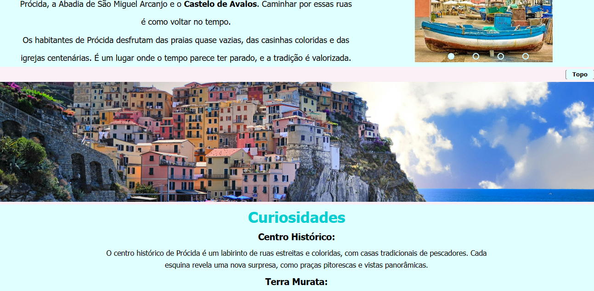

# Viagens--landing-page :airplane:

Este é um projeto desenvolvido como parte do curso de __Desenvolvimento Web__. O foco deste projeto está no __Front-End__, utilizando __HTML__ e __CSS__. A missão específica é avançar no desenvolvimento de páginas web estilizadas.

## Conceitos Abordados
#### Durante a realização deste projeto, foram abordados os seguintes conceitos:

- Seletores de tag: Utilize sempre as tags que apresentam semântica, aprendidas durante o curso: nav, main, section, article, aside, footer.
- Seletores de classe e IDs: Utilização de classes para reaplicar códigos. E id, quando você quer fazer algo especificamente com aquele elemento .
- Agrupamento de seletores: Organização eficiente das regras de estilo com a sêmantica.
- Descendência de elementos: Estilização de elementos filhos dentro de outros elementos.

## Estrutura do Projeto
#### O projeto possui os seguintes arquivos:

- __index.html__: Página principal da Agência de Viagem aaa.
- __css/__: Pasta contendo os arquivos CSS.
- __img/__: Pasta para armazenar imagens relacionadas à Agência de Viagem aaa.
- __img.assets/__: Pasta contendo fotos do site
- __readme.MD__: Este arquivo README.

## Como Contribuir
Se você deseja contribuir com melhorias ou correções para o projeto, sinta-se à vontade para fazer um _fork_ deste repositório.

## Layout
  

